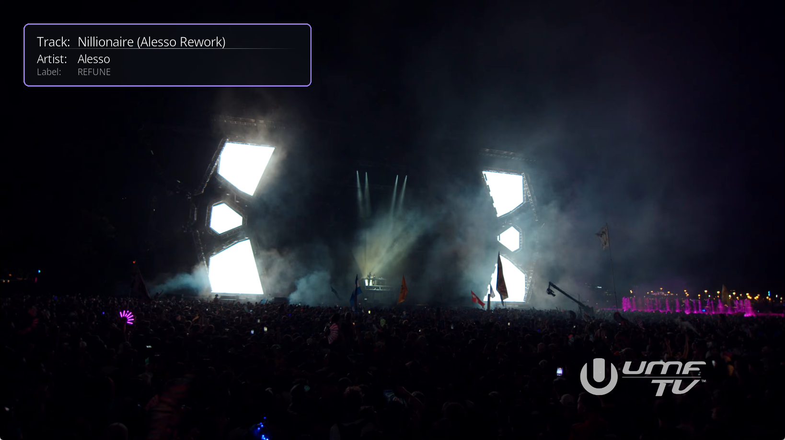

# Chapter Notify

**See what's playing. Every chapter.**

Chapter Notify displays a styled overlay notification when a new chapter starts during video playback. Designed for concert recordings and festival DJ sets with named chapters - know the artist, track, and label without checking your phone.

The perfect companion to [CrateDigger](https://github.com/Rouzax/CrateDigger), which embeds chapter markers from 1001Tracklists.

Built for Kodi 21+ (Omega and newer).

---

## How It Works

Point Chapter Notify at your concert library folders. When you play a video with named chapters (e.g. `Artist - Track [Label]`), an overlay appears on screen with:

- **Track** name (large)
- **Artist** name (medium)
- **Label** name (small, dimmed)

The overlay appears for a configurable duration, then slides or fades away. Any button press dismisses it instantly.

---

## Key Features

- **Chapter Parsing** - Automatically splits `Artist - Track [Label]` format into separate fields
- **4 Color Themes** - Golden Hour, Ultraviolet, Ember, and Nightfall with accent border and separator
- **6 Positions** - Top/bottom × left/center/right
- **Configurable Background** - Rounded panel with adjustable opacity (0-100%), or disable for floating text
- **Fade & Slide Animations** - Smooth transitions with instant dismiss on button press
- **Scrolling Text** - Long track/artist names scroll horizontally while prefixes stay fixed
- **Multiple Library Paths** - Monitor up to 3 folders

---

## Requirements

- **Kodi 21 (Omega)** or later
- Video files with named chapters (MKV, MP4, etc.)
- [CrateDigger](https://github.com/Rouzax/CrateDigger) for automatic chapter embedding (recommended)

---

## Installation

1. Download the latest zip from [Releases](https://github.com/Rouzax/service.chapternotify/releases)
2. In Kodi: **Settings → Add-ons → Install from zip file**
3. Configure your library paths in addon settings

---

## Settings

| Setting | Default | Description |
|---------|---------|-------------|
| Library paths (1-3) | - | Folders to monitor for chapter notifications |
| Trigger mode | Auto | Auto, Manual, or Both (see below) |
| Trigger button | Yellow | Which color button summons the overlay (Manual/Both only) |
| Display duration | 10 seconds | How long the overlay stays on screen |
| Animation style | Slide | Fade or slide transitions |
| Position | Top left | Where the overlay appears |
| Background opacity | 70% | Transparency of the dark panel (0-100%) |
| Theme | Ultraviolet | Color theme for accent border and separator |
| Show background | On | Toggle the panel background on/off |

---

## Trigger Modes

You can choose how the chapter overlay is summoned in **Settings > General > Trigger**:

- **Auto** (default) - The overlay appears automatically when a chapter changes during playback from a configured library path. This is the original v0.5.1 behavior.
- **Manual** - The overlay appears only when you press a chosen color button (Yellow, Red, Green, or Blue) on your remote during fullscreen video. The library path filter is bypassed, so you can summon chapter info on any media that has chapters. Press the same button again to dismiss the overlay.
- **Both** - The overlay appears automatically on chapter changes AND can be summoned manually with the button.

When you choose Manual or Both, the addon installs a small keymap file at `userdata/keymaps/service.chapternotify.xml` scoped to fullscreen video. The binding only fires during fullscreen video playback and never affects other Kodi screens. To remove the binding cleanly, click **Remove keymap binding** in settings.

The keymap binds both the remote color button (e.g. `<yellow>`) and its corresponding keyboard F-key (Yellow=F8, Red=F5, Green=F6, Blue=F7), so the trigger works on both remotes and keyboards.

**Before downgrading** to v0.5.1, click **Remove keymap binding** to avoid leaving an orphaned binding behind.

---

## License

[GPL-3.0-only](LICENSE)
